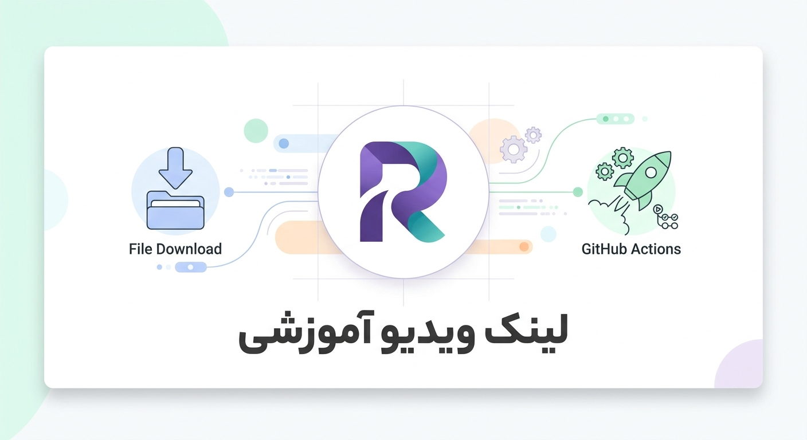

# 🚀 آموزش استفاده از Github-Rubika-Leecher

این پروژه برای دانلود فایل‌ها از لینک مستقیم و آپلود خودکار آن‌ها به پیام‌رسان روبیکا با استفاده از سرویس **GitHub Actions** طراحی شده است.

<div align="center">
  <a href="https://www.aparat.com/dashboard/videostat/mecsle7">
    
  </a>
</div>

## 📋 پیش‌نیازها
* یک اکانت گیت‌هاب و روبیکا (تحت هیچ شرایطی از اکانت های اصلی استفاده نکنید ، هیچ مسعولیتی بر عهده ما نمیباشد).
* پایتون (نسخه 3.10 یا بالاتر) نصب شده روی سیستم برای دریافت سشن.

---

## 🛠 مرحله اول: آماده‌سازی محلی (Local) و دریافت سشن

در این مرحله باید رشته اتصال به روبیکا را دریافت کنید:

1. **دانلود مخزن اصلی:**
   ابتدا مخزن را کلون کنید:
   ```bash
   git clone https://github.com/hadikiler/Github-Rubika-Leecher
   cd Github-Rubika-Leecher
   ```

2. **ساخت محیط مجازی (Virtual Environment):**
   ```bash
   python -m venv venv
   # در ویندوز:
   venv\scripts\activate.ps1
   # در لینوکس یا مک:
   source venv/bin/activate
   ```

3. **نصب کتابخانه‌های مورد نیاز:**
   ```bash
   pip install rubpy
   ```

4. **اجرای سشن‌ساز:**
   فایل `session_generator.py` را اجرا کنید:
   ```bash
   python session_generator.py
   ```
   * شماره موبایل خود را وارد کنید.
   * کد تایید ارسال شده به روبیکا را وارد کنید.
   * در نهایت یک رشته متنی طولانی (Base64) به شما داده می‌شود. آن را کپی کرده و در جایی مطمئن نگه دارید.

---

## ☁️ مرحله دوم: راه‌اندازی در گیت‌هاب (GitHub Setup)

1. **ساخت مخزن جدید:** در اکانت گیت‌هاب خود یک Repository جدید (عمومی یا خصوصی) بسازید.

2. **ساختار فایل‌ها:** مطابق تصویر زیر، فایل‌ها را در مخزن خود آپلود یا ایجاد کنید:
   * پوشه `.github/workflows/` و داخل آن فایل `smart-downloader.yml`
   * فایل `rubika_uploader.py` در ریشه اصلی مخزن.

   **ساختار نهایی باید به این شکل باشد:**
   ```text
   ├── .github/
   │   └── workflows/
   │       └── smart-downloader.yml
   └── rubika_uploader.py
   ```

3. **تنظیمات سکرت (Secrets):**
   * به تنظیمات مخزن خود (**Settings**) بروید.
   * از منوی سمت چپ به مسیر **Secrets and variables > Actions** بروید.
   * روی **New repository secret** کلیک کنید.
   * نام سکرت را `SESSION_FILE_BASE64` بگذارید و آن **رشته Base64** که در مرحله قبل گرفتید را در بخش Value قرار دهید و ذخیره کنید.

---

## 🚀 مرحله سوم: اجرا (Usage)

1. به تب **Actions** در بالای صفحه مخزن گیت‌هاب خود بروید.
2. در سمت چپ، روی ورک‌فلو `Rubika Cloud Uploader` کلیک کنید.
3. روی دکمه **Run workflow** کلیک کنید.
4. در کادر باز شده، آدرس لینک مستقیم فایلی که قصد دارید به روبیکا منتقل شود را وارد کنید.
5. دکمه سبز رنگ **Run workflow** را بزنید تا عملیات آغاز شود.

---
## 📦 نحوه چسباندن پارت‌ها به هم
پس از آپلود تمام پارت‌ها در روبیکا، آن‌ها را دانلود کرده داخل یک پوشه بریزید و با روش‌های زیر به هم متصل کنید (فقط یادتون باشه اسم فایل رو هرچی خاستید بزارید ولی پسوند رو باید پسوند فایل اصلی بزارید که میخواستید دانلود کنید مثلا mp4/zip/mkv/...):

*   **ویندوز (CMD):**
    ```cmd
    copy /b part_* full_file.zip
    ```
*   **اندروید:** از برنامه **ZArchiver** استفاده کنید (پارت‌ها را انتخاب و Extract کنید) (اندروید تست نکردم ولی میگن میشه) .
*   **لینوکس:**
    ```bash
    cat part_* > full_file.zip
    ```
---
### نکته جالب  ⚠️ : این پروژه خیلی جای رشد داره مثلا میتونید از aria2c برای دانلود سریعتر استفاده کنید یا اینکه چند تا ترد ران کنید تا چندین فایل رو همزمان به روبیکا بفرستن، حال داشتید تستش کنید.
## 👨‍💻 توسعه‌دهندگان و منابع
این پروژه بر پایه ایده **OctoFetch** توسعه یافته است.
*   **منبع اصلی:** [@king_network7](https://github.com/KNG7-P/OctoFetch)
*   **بازنویسی و بهینه‌سازی:** [hadikiler](https://github.com/hadikiler/Github-Rubika-Leecher)
### ✨ نکات مهم:
* **امنیت:** هرگز رشته Base64 سشن خود را در کدهای عمومی قرار ندهید؛ فقط از بخش Secrets استفاده کنید.
* **محدودیت:** گیت‌هاب اکشنز محدودیت زمانی و حجمی دارد، برای فایل‌های بسیار حجیم ممکن است با خطا مواجه شوید.

---
*اگر این پروژه برای شما مفید بود، یادتون نره به ریپازیتوری ستاره (⭐) بدید!*
<br>
*ساخته شده با ❤️ برای جامعه متن‌باز*
